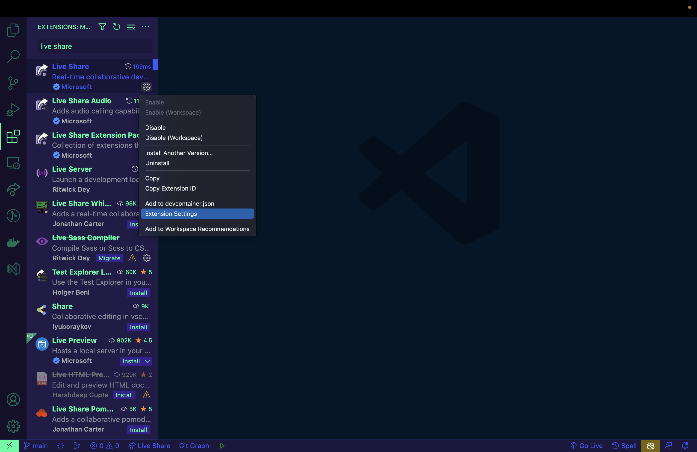

# README #

A generic project to bootstrap performing a TDD Kata in Javascript with remote pairing via VSCode Live Share.

### Prerequisites and set up

For local development you will need to install:

- [VS Code](https://code.visualstudio.com/) 
- The VS Code [Live Share extension](https://marketplace.visualstudio.com/items?itemName=MS-vsliveshare.vsliveshare-pack)
- [Node Js](https://nodejs.org/en/download/) + NPM 

Once the above is installed, run `npm install` in the project root directory.

You will need to configure the Live Share extension to Allow Guest Debug Control. To do this:
  - Open the Extensions sidebar in VS Code
  - Click on the settings cog on the right hand side of the Live Share extension within the sidebar
  - Select "Extension Settings"
  - In the tab that opens, enable the "Allow Guest Debug Control" setting and close the tab (it is saved automatically)

  

### Dependencies

Dependencies used in this project are:

[Jest](https://jestjs.io/) - for Unit Testing

### How to run tests

In VS Code, there is an included launch.json to enable running the tests using the Run and Debug tool. To run the tests in your CLI run `npm test` in the root directory.

Ensure the terminal is open when running tests remotely to see the results
